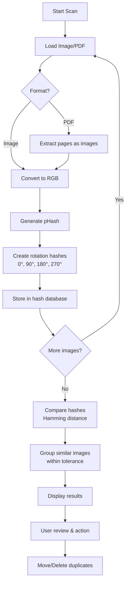
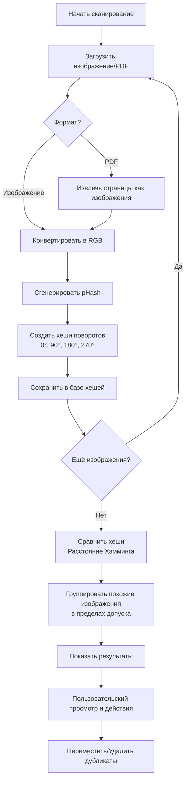

# Percepta - Duplicate Image Finder

<div align="center">


**A modern desktop application for finding duplicate images using perceptual hashing**

[English](#english) | [Русский](#русский)

</div>

---

<a name="english"></a>
## 🇬🇧 English Version

### 📖 Overview

Percepta is a powerful desktop application designed to find duplicate images using perceptual hashing algorithms. Unlike traditional duplicate finders that rely on file names or checksums, Percepta uses perceptual hashing (pHash) to identify visually similar images even if they have different formats, sizes, or slight modifications.

### ✨ Key Features

- **Perceptual Hashing**: Uses pHash algorithm to find visually similar images
- **Multiple Search Modes**:
  - **Single Folder**: Find duplicates within a single directory
  - **Multi-Folder**: Compare images across multiple folders against a reference folder
  - **Originals Management**: Manage and organize original images
- **Wide Format Support**: JPG, PNG, WebP, BMP, and even PDF files (extracts images from PDF pages)
- **Rotation Detection**: Automatically detects rotated versions of the same image (90°, 180°, 270°)
- **Adjustable Sensitivity**: Customizable tolerance level for hash comparison
- **Modern GUI**: Clean, intuitive interface built with CustomTkinter
- **Batch Operations**: Move or delete duplicate files in bulk
- **Recursive Scanning**: Option to scan subdirectories

### 🚀 Installation

#### Prerequisites
- Python 3.8 or higher
- pip package manager

#### Step-by-Step Installation

1. **Clone or download the repository**
   ```bash
   git clone https://github.com/yourusername/percepta.git
   cd percepta
   ```

2. **Install dependencies**
   ```bash
   pip install -r requirements.txt
   ```

3. **Run the application**
   ```bash
   python main.py
   ```

### 📦 Dependencies

The application requires the following Python packages (automatically installed via `requirements.txt`):
- `Pillow` - Image processing
- `ImageHash` - Perceptual hashing algorithms
- `PyMuPDF` - PDF file support
- `CustomTkinter` - Modern GUI framework

### 🖥️ Usage

1. **Launch the application** by running `python main.py`
2. **Choose a search mode** from the sidebar:
   - **Single Folder**: Find duplicates within one folder
   - **Multi-Folder**: Compare multiple folders against a reference
   - **Originals**: Manage your original images collection
   - **Settings**: Configure application preferences

3. **Configure search parameters**:
   - Select target folder(s)
   - Adjust tolerance level (lower = stricter, higher = more matches)
   - Choose whether to scan subdirectories

4. **Start the scan** and review results
5. **Manage duplicates**:
   - View side-by-side comparisons
   - Select which copies to keep
   - Move or delete unwanted duplicates

### 🏗️ Architecture

```
Percepta/
├── main.py              # Application entry point
├── src/
│   ├── config.py        # Configuration constants
│   ├── scanner.py       # Core scanning and hashing logic
│   ├── utils.py         # Utility functions
│   └── ui/
│       ├── app.py       # Main application window
│       ├── ui_components.py # UI components and styling
│       └── views/       # Different application views
│           ├── view_single.py    # Single folder view
│           ├── view_multi.py     # Multi-folder view
│           ├── view_originals.py # Originals management
│           └── view_settings.py  # Settings view
├── assets/
│   └── fonts/           # Custom fonts and icons
└── requirements.txt     # Python dependencies
```

### 🔧 Technical Details

#### How It Works
1. **Image Processing**: Each image is loaded and converted to RGB format
2. **Perceptual Hashing**: The pHash algorithm creates a 64-bit hash representing the image's visual characteristics
3. **Rotation Handling**: Four hashes are generated for each image (original + 90°, 180°, 270° rotations)
4. **Comparison**: Hashes are compared using Hamming distance
5. **Grouping**: Images with similar hashes (within tolerance) are grouped as duplicates

#### Workflow Diagram



#### Supported Formats
- **Image formats**: `.jpg`, `.jpeg`, `.png`, `.webp`, `.bmp`
- **Document formats**: `.pdf` (images are extracted from each page)

#### Performance Considerations
- Large image collections may take time to process
- PDF files with many pages require additional processing
- Memory usage scales with the number of images being compared

### 📝 License

This project is licensed under the MIT License - see the LICENSE file for details.

### 🤝 Contributing

Contributions are welcome! Please feel free to submit a Pull Request.

1. Fork the repository
2. Create your feature branch (`git checkout -b feature/AmazingFeature`)
3. Commit your changes (`git commit -m 'Add some AmazingFeature'`)
4. Push to the branch (`git push origin feature/AmazingFeature`)
5. Open a Pull Request

### 🐛 Reporting Issues

If you encounter any bugs or have feature requests, please open an issue on GitHub.

---

<a name="русский"></a>
## 🇷🇺 Русская версия

### 📖 Обзор

Percepta — это мощное настольное приложение для поиска дубликатов изображений с использованием алгоритмов перцептивного хеширования. В отличие от традиционных поисковиков дубликатов, которые полагаются на имена файлов или контрольные суммы, Percepta использует перцептивное хеширование (pHash) для идентификации визуально похожих изображений, даже если они имеют разные форматы, размеры или незначительные модификации.

### ✨ Ключевые возможности

- **Перцептивное хеширование**: Использует алгоритм pHash для поиска визуально похожих изображений
- **Несколько режимов поиска**:
  - **Одна папка**: Поиск дубликатов в одной директории
  - **Несколько папок**: Сравнение изображений из нескольких папок с эталонной папкой
  - **Управление оригиналами**: Организация и управление коллекцией оригинальных изображений
- **Широкая поддержка форматов**: JPG, PNG, WebP, BMP, а также PDF файлы (извлекает изображения со страниц PDF)
- **Обнаружение поворотов**: Автоматически находит повёрнутые версии одного изображения (90°, 180°, 270°)
- **Настраиваемая чувствительность**: Регулируемый уровень допуска для сравнения хешей
- **Современный интерфейс**: Чистый, интуитивный интерфейс на базе CustomTkinter
- **Пакетные операции**: Перемещение или удаление дубликатов группами
- **Рекурсивное сканирование**: Опция сканирования поддиректорий

### 🚀 Установка

#### Предварительные требования
- Python 3.8 или выше
- Менеджер пакетов pip

#### Пошаговая установка

1. **Клонируйте или скачайте репозиторий**
   ```bash
   git clone https://github.com/yourusername/percepta.git
   cd percepta
   ```

2. **Установите зависимости**
   ```bash
   pip install -r requirements.txt
   ```

3. **Запустите приложение**
   ```bash
   python main.py
   ```

### 📦 Зависимости

Приложению требуются следующие Python пакеты (устанавливаются автоматически через `requirements.txt`):
- `Pillow` — обработка изображений
- `ImageHash` — алгоритмы перцептивного хеширования
- `PyMuPDF` — поддержка PDF файлов
- `CustomTkinter` — современный фреймворк для GUI

### 🖥️ Использование

1. **Запустите приложение**, выполнив `python main.py`
2. **Выберите режим поиска** в боковой панели:
   - **Одна папка**: Поиск дубликатов в одной папке
   - **Несколько папок**: Сравнение нескольких папок с эталоном
   - **Оригиналы**: Управление коллекцией оригинальных изображений
   - **Настройки**: Конфигурация параметров приложения

3. **Настройте параметры поиска**:
   - Выберите целевую папку(и)
   - Отрегулируйте уровень допуска (ниже = строже, выше = больше совпадений)
   - Выберите, сканировать ли поддиректории

4. **Запустите сканирование** и просмотрите результаты
5. **Управляйте дубликатами**:
   - Просматривайте сравнения бок о бок
   - Выбирайте, какие копии оставить
   - Перемещайте или удаляйте ненужные дубликаты

### 🏗️ Архитектура

```
Percepta/
├── main.py              # Точка входа в приложение
├── src/
│   ├── config.py        # Константы конфигурации
│   ├── scanner.py       # Основная логика сканирования и хеширования
│   ├── utils.py         # Вспомогательные функции
│   └── ui/
│       ├── app.py       # Главное окно приложения
│       ├── ui_components.py # Компоненты интерфейса и стили
│       └── views/       # Различные представления приложения
│           ├── view_single.py    # Представление одной папки
│           ├── view_multi.py     # Представление нескольких папок
│           ├── view_originals.py # Управление оригиналами
│           └── view_settings.py  # Настройки
├── assets/
│   └── fonts/           # Пользовательские шрифты и иконки
└── requirements.txt     # Зависимости Python
```

### 🔧 Технические детали

#### Как это работает
1. **Обработка изображений**: Каждое изображение загружается и конвертируется в RGB формат
2. **Перцептивное хеширование**: Алгоритм pHash создаёт 64-битный хеш, представляющий визуальные характеристики изображения
3. **Обработка поворотов**: Для каждого изображения генерируются четыре хеша (оригинал + повороты на 90°, 180°, 270°)
4. **Сравнение**: Хеши сравниваются с использованием расстояния Хэмминга
5. **Группировка**: Изображения с похожими хешами (в пределах допуска) группируются как дубликаты

#### Диаграмма workflow



#### Поддерживаемые форматы
- **Форматы изображений**: `.jpg`, `.jpeg`, `.png`, `.webp`, `.bmp`
- **Форматы документов**: `.pdf` (изображения извлекаются с каждой страницы)

#### Особенности производительности
- Большие коллекции изображений могут обрабатываться продолжительное время
- PDF файлы со многими страницами требуют дополнительной обработки
- Использование памяти зависит от количества сравниваемых изображений

### 📝 Лицензия

Этот проект лицензирован под лицензией MIT — подробности см. в файле LICENSE.

### 🤝 Участие в разработке

Мы приветствуем вклад в проект! Пожалуйста, не стесняйтесь отправлять Pull Request.

1. Сделайте форк репозитория
2. Создайте ветку для вашей функции (`git checkout -b feature/AmazingFeature`)
3. Зафиксируйте изменения (`git commit -m 'Add some AmazingFeature'`)
4. Отправьте в ветку (`git push origin feature/AmazingFeature`)
5. Откройте Pull Request

### 🐛 Сообщение об ошибках

Если вы столкнулись с ошибками или у вас есть запросы на новые функции, пожалуйста, откройте issue на GitHub.

---

<div align="center">

**Percepta** — умный поиск дубликатов изображений

</div>