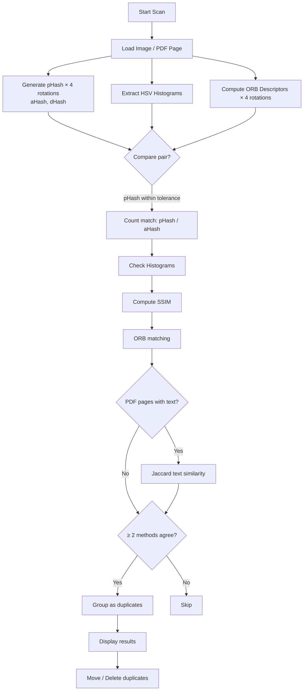
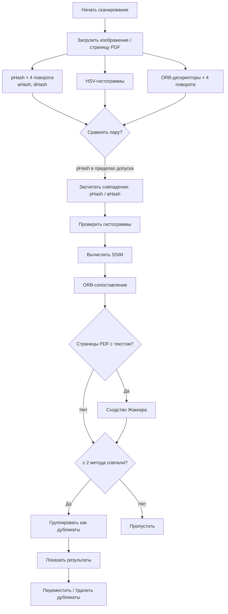

# Percepta — Duplicate Image Finder

<div align="center">


**A modern desktop application for finding duplicate images using perceptual hashing**

[English](#english) | [Русский](#русский)

</div>

---

<a name="english"></a>
## English Version

### Overview

Percepta ("Find me") is a powerful desktop application for finding duplicate images using a multi-stage hybrid algorithm. Unlike traditional duplicate finders that rely on file names or checksums, Percepta combines pHash, aHash, dHash, HSV histograms, SSIM, and ORB descriptors to identify visually similar images even if they have different formats, sizes, compression levels, or slight modifications.

### Key Features

- **Two Search Modes**:
  - **Duplicates**: Find identical or visually similar images within a folder
  - **Originals**: Find original high-resolution images among lower-quality copies
- **Multi-Stage Hybrid Algorithm**: pHash + aHash + dHash + HSV histograms + SSIM + ORB descriptors (requires ≥ 2 methods to agree, minimising false positives)
- **Wide Format Support**: JPG, PNG, WebP, BMP, and PDF files (extracts and compares individual pages)
- **Rotation Detection**: Automatically detects rotated versions of the same image (0°, 90°, 180°, 270°)
- **Text Similarity Check**: For PDF pages with enough text content, Jaccard similarity is used as an additional guard against false positives
- **Parallel Processing**: Multi-core image pre-processing via Python `multiprocessing`
- **Adjustable Sensitivity**: Customisable tolerance level; SSIM threshold adapts automatically
- **Modern GUI**: Clean, intuitive interface built with CustomTkinter
- **Batch Operations**: Move or delete duplicate files in bulk
- **Recursive Scanning**: Option to scan subdirectories

### Installation

#### Prerequisites
- Python 3.8 or higher
- pip package manager

#### Step-by-Step Installation

1. **Clone the repository**
   ```bash
   git clone https://github.com/ephra1m9/percepta.git
   cd percepta
   ```

2. **Install dependencies**
   ```bash
   pip install -r requirements.txt
   ```

3. **Run the application**
   ```bash
   python main.py
   ```

### Pre-built Binaries

A pre-built macOS app bundle for Apple Silicon (M1/M2/M3) is automatically built via GitHub Actions on every manual trigger.  
Download the latest `Find-me-macOS-Apple-Silicon.zip` from the **Actions → Build macOS App** workflow artifacts.

### Dependencies

Installed automatically via `requirements.txt`:

| Package | Purpose |
|---|---|
| `Pillow` | Image loading and conversion |
| `ImageHash` | pHash / aHash / dHash generation |
| `PyMuPDF` | PDF page extraction and text reading |
| `opencv-python` | ORB descriptors, HSV histograms, SSIM |
| `CustomTkinter` | Modern GUI framework |

### Usage

1. **Launch** the application with `python main.py`
2. **Choose a search mode** from the main menu:
   - **Duplicates** — find identical or visually similar images in a folder
   - **Originals** — find high-resolution originals for lower-quality copies
3. **Configure search parameters**: target folder(s), tolerance level, subdirectory scanning
4. **Start the scan** and review results
5. **Manage duplicates**: view side-by-side comparisons, select copies to keep, move or delete unwanted files

### Architecture

```
Percepta/
├── main.py                  # Entry point
├── ui/
│   ├── app.py               # Main application window
│   ├── ui_components.py     # Shared UI components and styling
│   └── pages/
│       ├── page_duplicates.py   # Duplicate search view
│       └── page_originals.py    # Originals search view
├── utils/
│   ├── config.py            # App constants (version, title, extensions)
│   ├── helper.py            # File discovery and status helpers
│   └── scanner.py           # Core hashing, comparison, and search logic
├── assets/
│   └── fonts/               # Custom fonts and icons
├── Find me.spec             # PyInstaller spec (Windows)
├── Find me Mac.spec         # PyInstaller spec (macOS)
└── requirements.txt
```

### Technical Details

#### Comparison Pipeline

Each image (or PDF page) is processed into a feature vector containing:

| Feature | Method | Notes |
|---|---|---|
| pHash | 64-bit perceptual hash × 4 rotations | Primary filter |
| aHash | Average hash | Fast secondary check |
| dHash | Difference hash | Structural supplement |
| HSV histograms | H (32 bins) + S (16) + V (16), L1-normalised | Colour similarity |
| ORB descriptors | 800 keypoints, BFMatcher + Lowe ratio test | Rotation-invariant matching |
| SSIM | Structural Similarity Index (Gaussian-weighted) | Final pixel-level guard |
| Text (PDF only) | Word-level Jaccard similarity | Prevents false matches between different document pages |

**Decision rule for duplicate detection**: at least **2 out of 6** methods must agree. The SSIM threshold scales with tolerance (stricter at low values, looser at high).

#### Workflow Diagram



#### Supported Formats
- **Images**: `.jpg`, `.jpeg`, `.png`, `.webp`, `.bmp`
- **Documents**: `.pdf` — every page is extracted and compared independently

#### Performance Notes
- Image data is cached after first load; rescanning the same folder is instant
- Pre-processing runs in parallel across CPU cores (falls back to sequential on error)
- SSIM comparison uses downscaled copies (max 512 px) for speed
- Large PDF files with many pages require additional time on first scan

### Building from Source

**Windows** (via PyInstaller):
```bash
pip install pyinstaller
pyinstaller "Find me.spec"
# Output: dist/Find me/Find me.exe
```

**macOS** (Apple Silicon — also automated via GitHub Actions):
```bash
pip install pyinstaller
pyinstaller "Find me Mac.spec"
# Output: dist/Find me.app
```

### License

This project is licensed under the MIT License — see the LICENSE file for details.

### Contributing

Contributions are welcome! Please submit a Pull Request.

1. Fork the repository
2. Create your feature branch (`git checkout -b feature/AmazingFeature`)
3. Commit your changes (`git commit -m 'Add some AmazingFeature'`)
4. Push to the branch (`git push origin feature/AmazingFeature`)
5. Open a Pull Request

### Reporting Issues

Please open an issue on GitHub if you encounter bugs or have feature requests.

---

<a name="русский"></a>
## Русская версия

### Обзор

Percepta («Find me») — настольное приложение для поиска дубликатов изображений с использованием многоэтапного гибридного алгоритма. В отличие от традиционных инструментов, полагающихся на имена файлов или контрольные суммы, Percepta объединяет pHash, aHash, dHash, HSV-гистограммы, SSIM и ORB-дескрипторы для надёжного обнаружения визуально схожих изображений, даже если они отличаются форматом, размером, степенью сжатия или имеют незначительные правки.

### Ключевые возможности

- **Два режима поиска**:
  - **Дубликаты**: поиск идентичных или визуально схожих изображений в папке
  - **Оригиналы**: нахождение оригиналов высокого разрешения среди копий низкого качества
- **Многоэтапный гибридный алгоритм**: pHash + aHash + dHash + HSV-гистограммы + SSIM + ORB-дескрипторы (минимум 2 метода из 6 должны подтвердить совпадение)
- **Широкая поддержка форматов**: JPG, PNG, WebP, BMP и PDF (каждая страница обрабатывается независимо)
- **Обнаружение поворотов**: автоматически находит повёрнутые версии изображений (0°, 90°, 180°, 270°)
- **Проверка текстового содержимого**: для PDF-страниц с достаточным количеством текста используется сходство Жаккара как дополнительная защита от ложных совпадений
- **Параллельная обработка**: предварительная обработка изображений распределяется по ядрам CPU через `multiprocessing`
- **Настраиваемая чувствительность**: регулируемый уровень допуска; порог SSIM адаптируется автоматически
- **Современный интерфейс**: чистый интуитивный интерфейс на базе CustomTkinter
- **Пакетные операции**: перемещение или удаление дубликатов группами
- **Рекурсивное сканирование**: опция обхода поддиректорий

### Установка

#### Предварительные требования
- Python 3.8 или выше
- Менеджер пакетов pip

#### Пошаговая установка

1. **Клонируйте репозиторий**
   ```bash
   git clone https://github.com/ephra1m9/percepta.git
   cd percepta
   ```

2. **Установите зависимости**
   ```bash
   pip install -r requirements.txt
   ```

3. **Запустите приложение**
   ```bash
   python main.py
   ```

### Готовые сборки

Сборка для macOS Apple Silicon (M1/M2/M3) автоматически создаётся через GitHub Actions.  
Скачайте `Find-me-macOS-Apple-Silicon.zip` из артефактов workflow **Actions → Build macOS App**.

### Зависимости

Устанавливаются автоматически через `requirements.txt`:

| Пакет | Назначение |
|---|---|
| `Pillow` | Загрузка и конвертация изображений |
| `ImageHash` | Генерация pHash / aHash / dHash |
| `PyMuPDF` | Извлечение страниц и текста из PDF |
| `opencv-python` | ORB-дескрипторы, HSV-гистограммы, SSIM |
| `CustomTkinter` | Современный GUI-фреймворк |

### Использование

1. **Запустите приложение**, выполнив `python main.py`
2. **Выберите режим поиска** в главном меню:
   - **Дубликаты** — поиск идентичных или визуально схожих изображений в папке
   - **Оригиналы** — оригиналы высокого разрешения для копий
3. **Настройте параметры**: целевая папка(и), уровень допуска, сканирование поддиректорий
4. **Запустите сканирование** и просмотрите результаты
5. **Управляйте дубликатами**: сравнение бок о бок, выбор копий для удаления, перемещение или удаление

### Архитектура

```
Percepta/
├── main.py                  # Точка входа
├── ui/
│   ├── app.py               # Главное окно приложения
│   ├── ui_components.py     # Общие компоненты интерфейса и стили
│   └── pages/
│       ├── page_duplicates.py   # Экран поиска дубликатов
│       └── page_originals.py    # Экран поиска оригиналов
├── utils/
│   ├── config.py            # Константы (версия, название, расширения)
│   ├── helper.py            # Обход файлов и обновление статуса
│   └── scanner.py           # Хеширование, сравнение и логика поиска
├── assets/
│   └── fonts/               # Шрифты и иконки
├── Find me.spec             # Конфиг PyInstaller (Windows)
├── Find me Mac.spec         # Конфиг PyInstaller (macOS)
└── requirements.txt
```

### Технические детали

#### Конвейер сравнения

Каждое изображение (или страница PDF) преобразуется в вектор признаков:

| Признак | Метод | Примечание |
|---|---|---|
| pHash | 64-битный перцептивный хеш × 4 поворота | Основной фильтр |
| aHash | Средний хеш | Быстрая вторичная проверка |
| dHash | Разностный хеш | Структурное дополнение |
| HSV-гистограммы | H (32 бина) + S (16) + V (16), нормализация L1 | Цветовое сходство |
| ORB-дескрипторы | 800 ключевых точек, BFMatcher + тест отношения Лоу | Инвариантное к повороту сравнение |
| SSIM | Структурный индекс схожести (Гауссово взвешивание) | Финальная пиксельная проверка |
| Текст (только PDF) | Сходство Жаккара по словам | Защита от совпадений разных страниц документов |

**Решение о дублировании**: как минимум **2 из 6** методов должны подтвердить совпадение. Порог SSIM масштабируется с уровнем допуска (строже при малых значениях, мягче при больших).

#### Диаграмма workflow



#### Поддерживаемые форматы
- **Изображения**: `.jpg`, `.jpeg`, `.png`, `.webp`, `.bmp`
- **Документы**: `.pdf` — каждая страница извлекается и сравнивается независимо

#### Особенности производительности
- Данные изображений кэшируются после первой загрузки; повторное сканирование той же папки выполняется мгновенно
- Предварительная обработка выполняется параллельно на нескольких ядрах CPU (при ошибке автоматически переключается на последовательную)
- SSIM вычисляется на уменьшенных копиях (макс. 512 пкс) для скорости
- Большие PDF-файлы со многими страницами требуют дополнительного времени при первом сканировании

### Сборка из исходников

**Windows** (через PyInstaller):
```bash
pip install pyinstaller
pyinstaller "Find me.spec"
# Результат: dist/Find me/Find me.exe
```

**macOS** (Apple Silicon — также автоматизировано через GitHub Actions):
```bash
pip install pyinstaller
pyinstaller "Find me Mac.spec"
# Результат: dist/Find me.app
```

### Лицензия

Этот проект лицензирован под лицензией MIT — подробности в файле LICENSE.

### Участие в разработке

Мы приветствуем вклад в проект! Пожалуйста, отправляйте Pull Request.

1. Сделайте форк репозитория
2. Создайте ветку для вашей функции (`git checkout -b feature/AmazingFeature`)
3. Зафиксируйте изменения (`git commit -m 'Add some AmazingFeature'`)
4. Отправьте в ветку (`git push origin feature/AmazingFeature`)
5. Откройте Pull Request

### Сообщение об ошибках

Если вы столкнулись с ошибками или у вас есть запросы на новые функции, откройте issue на GitHub.
