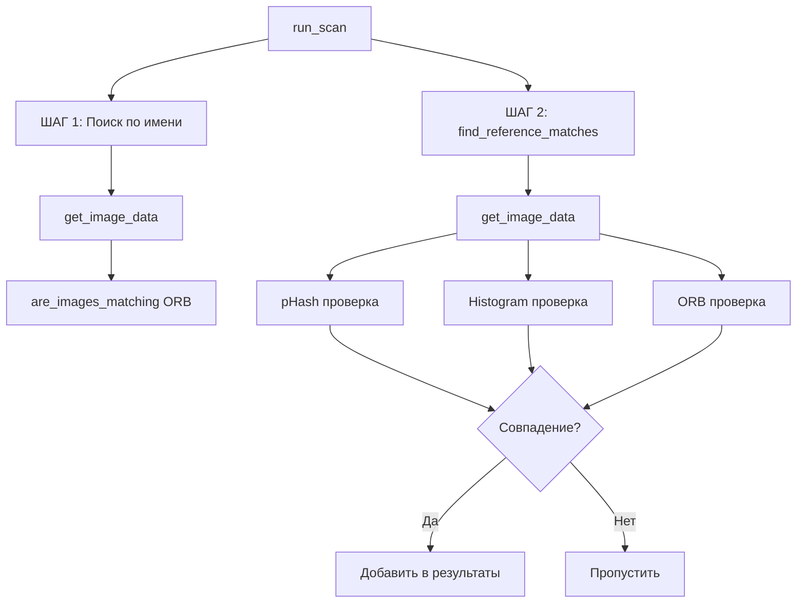
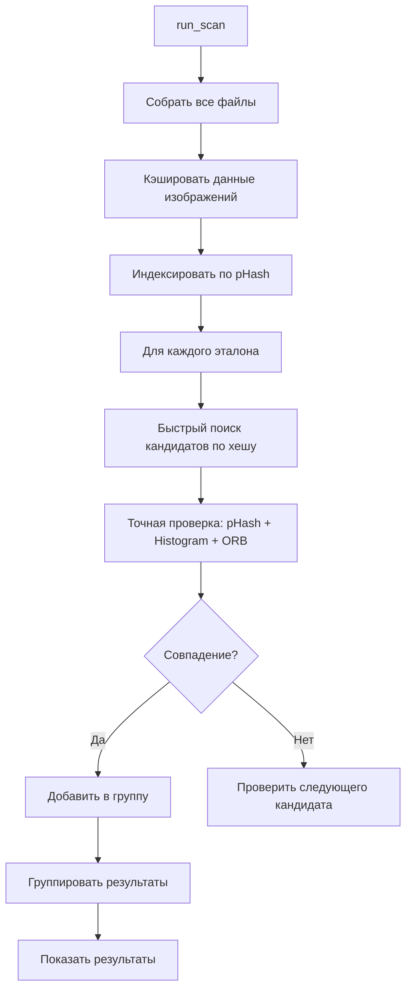

# План исправлений: Режим поиска по эталону

## Проблема
Режим поиска по эталону находит далеко не все изображения и работает не корректно. Должен находить в добавленных папках изображения, которые уже есть в эталонной папке (идентичные копии, отретушированные, кадрированные версии).

---

## Ключевые проблемы

### 1. Слишком строгие пороги в `find_reference_matches`
- `pHash tolerance=15` — мало для отретушированных изображений
- `histogram_threshold=0.70` — избыточно строгий
- ORB не используется как резервный метод

### 2. Нет кэширования данных изображений
- `get_image_data` вызывается повторно для одних и тех же файлов
- Нет индексации по хешам для быстрого поиска кандидатов

### 3. Дублирование логики ШАГ 1 и ШАГ 2
- ШАГ 1: поиск по имени + ORB
- ШАГ 2: поиск по pHash + гистограммы + ORB
- Результаты не объединяются корректно

### 4. Проблема с нормализацией гистограмм
- `cv2.HISTCMP_CORREL`: 1.0 = полное совпадение, -1.0 = полная противоположность
- Формула `(similarity + 1.0) / 2.0` даёт 0.5 при противоположных гистограммах
- Порог 0.70 означает корреляцию ≥ 0.4, что слишком мало

---

## План исправлений

### Этап 1: Исправить `find_reference_matches` в `scanner.py`

#### 1.1 Улучшить кэширование
```python
# Создать глобальный кэш для всех данных изображений
_image_data_cache = {}

def get_image_data_cached(path):
    """Кэшированная версия get_image_data"""
    if path not in _image_data_cache:
        _image_data_cache[path] = get_image_data(path)
    return _image_data_cache[path]
```

#### 1.2 Улучшить поиск pHash
```python
# Увеличить порог pHash для отретушированных изображений
phash_tolerance = min(25, tolerance + 10)  # было: tolerance
```

#### 1.3 Исправить нормализацию гистограмм
```python
# Использовать более надёжную метрику
# cv2.HISTCMP_CHISQR — чем меньше, тем лучше
# cv2.HISTCMP_BHATTACHARYYA — чем меньше, тем лучше
# Вместо CORREL использовать Intersection для HSV
```

#### 1.4 Добавить резервный ORB для всех случаев
```python
# ORB должен проверяться всегда, не только если pHash + hist не прошли
# Особенно важно для кадрированных изображений
```

### Этап 2: Упростить `run_scan` в `page_reference.py`

#### 2.1 Объединить ШАГ 1 и ШАГ 2
```python
# Убрать дублирование
# Использовать единый алгоритм с find_reference_matches
# Убрать предварительный поиск по имени (он уже есть в find_reference_matches)
```

#### 2.2 Улучшить поиск по имени
```python
def clean_filename(filename):
    # Улучшить регулярное выражение для очистки имен
    # Добавить нормализацию Unicode
    # Учитывать больше вариантов суффиксов
```

### Этап 3: Улучшить алгоритм сравнения

#### 3.1 Использовать aHash + dHash + pHash
```python
# Для лучшего обнаружения отретушированных изображений
# Комбинировать несколько типов хешей
```

#### 3.2 Добавить SSIM (Structural Similarity Index)
```python
# Для сравнения структуры изображений
# Более устойчив к изменениям яркости/контраста
```

#### 3.3 Улучшить ORB сравнение
```python
# Использовать более низкий порог Lowe's ratio
# Увеличить количество дескрипторов
# Добавить проверку геометрической согласованности
```

---

## Mermaid диаграмма: Текущая архитектура



## Mermaid диаграмма: Новая архитектура



---

## Приоритет задач

1. **[ ]** Исправить кэширование в `scanner.py`
2. **[ ]** Улучшить пороги pHash и гистограмм
3. **[ ]** Добавить SSIM как дополнительную метрику
4. **[ ]** Упростить логику `run_scan` в `page_reference.py`
5. **[ ]** Улучшить поиск по имени файла
6. **[ ]** Протестировать на реальных данных
